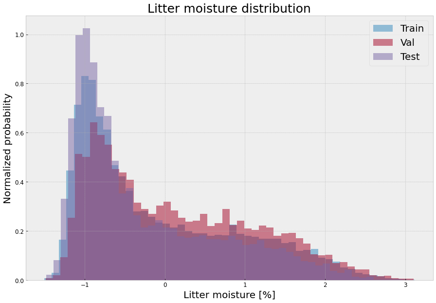

# Prediction of litter moisture

Litter moisture measurements are a very important element of fire risk estimation (at least in Polish State Forests) on the basis of which appropriate fire-fighting measures are taken, such as launching pedestrian or air patrols. On the other hand, the process of litter moisture measurement is quite burdensome for foresters, every day at 9:00 and 13:00 forest litter samples are collected, which are then dried using a moisture analyzer and the litter moisture value is calculated.

Since forestry has numerous meteorological stations and data recorded by these stations and a record of litter moisture measurements from many years, we hypothesized that litter moisture is a variable dependent on meteorological data and we developed a machine learning model that estimates the moisture content of the litter.

## Data exploration

Details of data mining and preprocessing are described in notebooks [1_data_exploration.ipynb](1_data_exploration.ipynb) and [2_data_preprocesing.ipynb](2_data_preprocesing.ipynb) . For each of several dozen locations, weather data (X) and litter moisture value (Y) are saved in a separate CSV file. Then it was checked which data were missing and what their distributions were in order to choose the best set of features.

## Assumptions and concepts

### Time series representation

Meteo data is a multivariate time series. We wanted to take into account the longest possible time horizon, however, we wanted a high temporal resolution of observations, especially recorded just before the prediction period. For example, information about 20 minutes of rain an hour before the estimate will have a significant impact, but such a short rain from 3 weeks ago is irrelevant, we want to know that it was rainy weather in general.

We decided to represent single time series as a set of time series of different granularity, as was shown on figure X. In this way, the input data is relatively small, we can use long time horizont, and the most recent data are presented with high granularity. Figure X shows how the individual inputs data sample look like.

### Normalization of predicted value

Generally, in regression we can have a problem when our target is unbalanced, ideally it should come from a planar or normal distribution. The litter moisture distribution shown in Figure X does not have Gaussian characteristics. We could have used gaussian_kde and balance the examples based on it, either by upsumfile or by weighting the examples. However, we decided to present the problem differently, which brought us closer to the Gaussian distribution in a more natural way.

After consulting the foresters, we learned that morning measurements will be made anyway because they do not disturb the working day and that afternoon measurements are problematic. So we can, instead of estimating the absolute value of the humidity, we can estimate the percentage change in the humidity of the litter relative to the morning measurement. The distribution of litter humidity change in the afternoon measurement in relation to the morning measurement is shown in Figure X, much closer to the normal distribution.
This solves an additional problem of representing the relevant metrics. When the litter humidity is 50\% and the prediction is 55%, it is an incomparably less dangerous error than when the value of 15\% is predicted relative to the real humidity of 10\%. Even though the relative distance error metrics will be identical. In this case, the mean and median absolute percentage error metric is definitely more useful.

## Trained models
Several models have been trained. Each time, Optuna was used to optimize the hyperparameters. The training of individual models takes place in notebooks: LSTM, CONV, CONV_LSTM, DENSE, TRANSFORMER. In addition to the family of deep learning models, I also trained the GBM model and outperforms some neural models.
Also, we ensembled the trained models, in a classic manner, without adjusting the weights, and by removing one (or two) of the last layers. In second attempt the output was concatenated and the last layer was trained, while freezing the weights of the original base models. I have presented experiments with various forms of ensembling in the ENSEMBLE notebook. The table below shows the results of the different variants.
